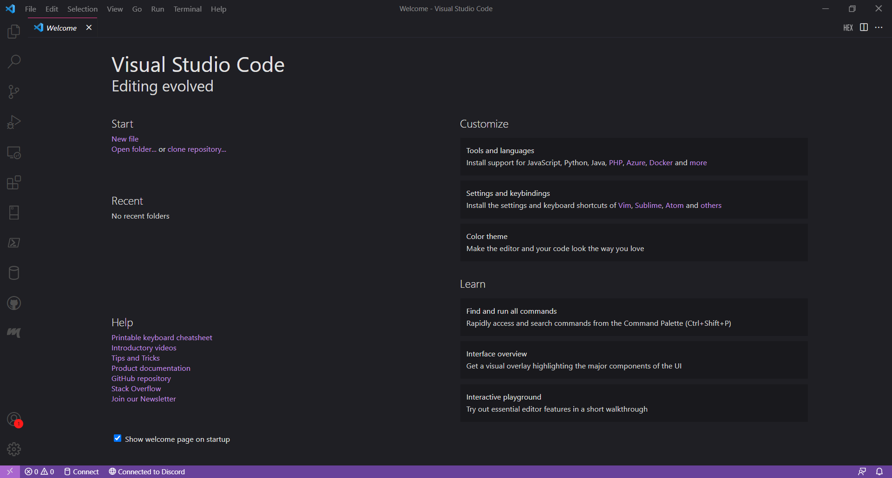
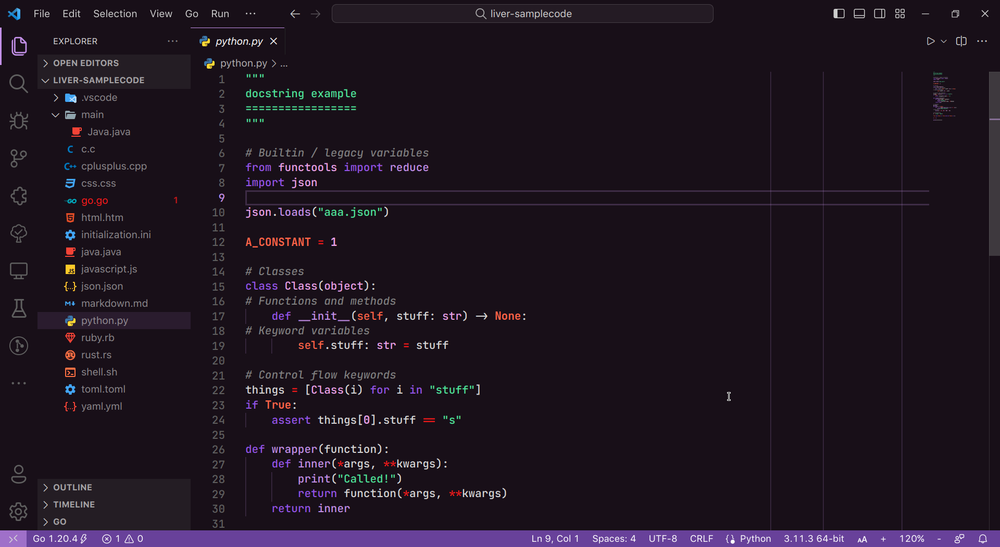
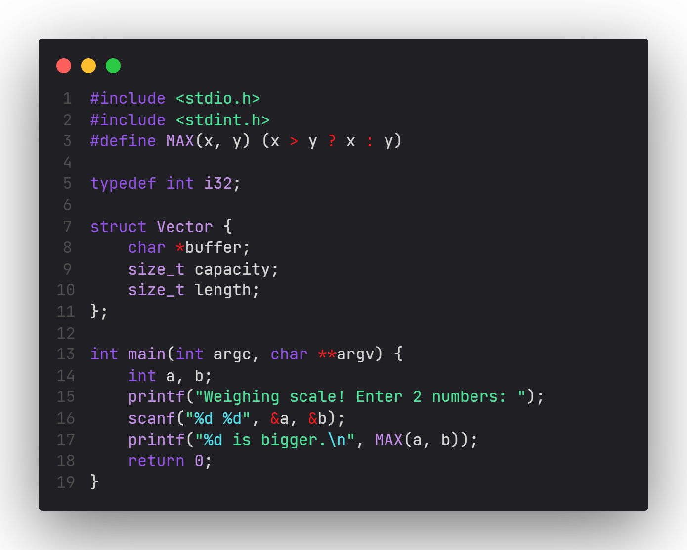
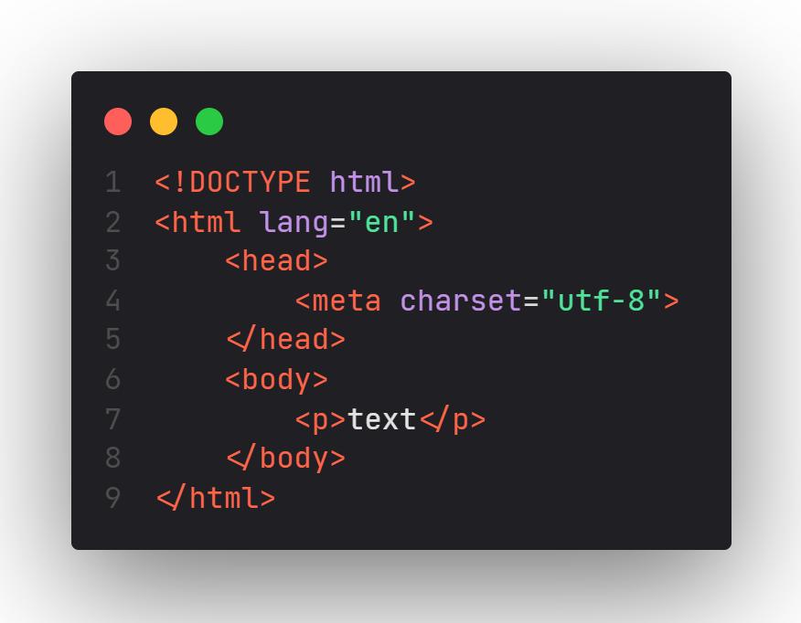
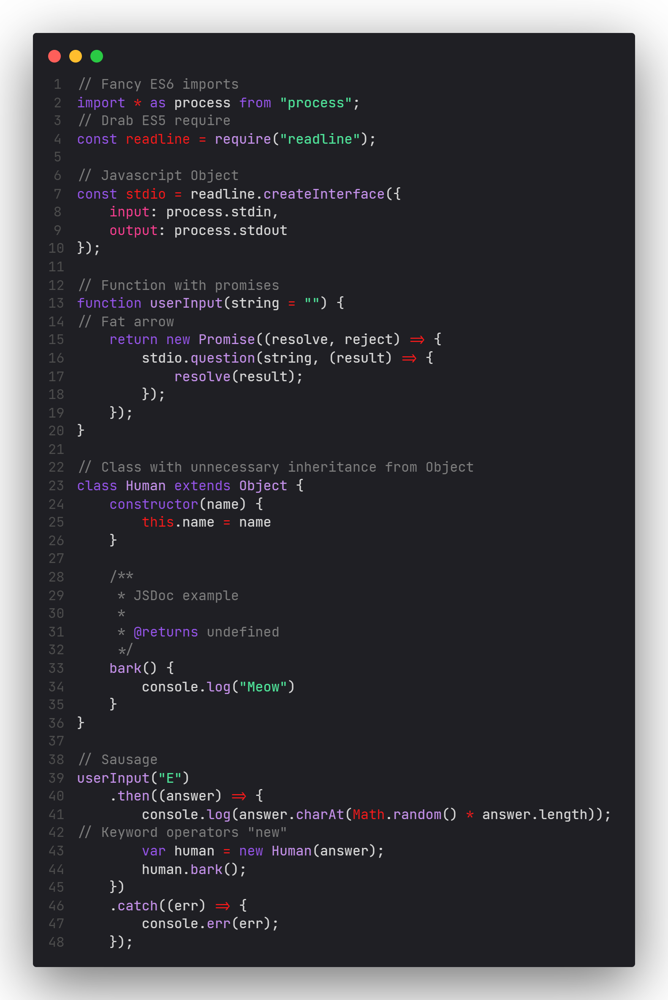
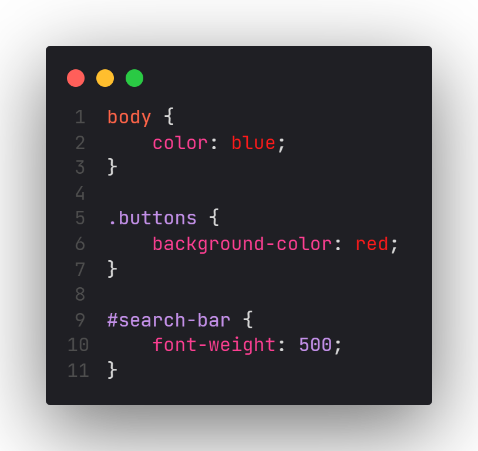

# LiVer v0.5.0

[Github Repo](https://github.com/RenoirTan/liver)

This is a VSCode theme which uses colours mainly between lilac and vermillion.
It also tries to limit the use of bold and italic font styles to markup files
such as markdown.

## Liver Dark vs Liver Purple

Liver Dark uses black and gray as its background theme, with violet as its
accents. On the other hand, Liver Purple predominantly uses violet as the
background colour, with white as the accent colour.

## Screenshots

Some screenshots of code samples taken using
[CodeSnap](https://marketplace.visualstudio.com/items?itemName=adpyke.codesnap).

File Icon Theme:
[Helium Icon Theme](https://marketplace.visualstudio.com/items?itemName=helgardrichard.helium-icon-theme)

Product Icon Theme:
[Fluent Icons](https://marketplace.visualstudio.com/items?itemName=miguelsolorio.fluent-icons)

### Welcome Page

### Python

### C

### HTML

### JavaScript

### CSS

